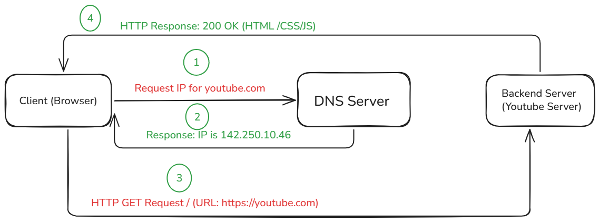

# How the Web Works - Request & Response Lifecycle

This project demonstrates the step-by-step journey of an HTTP Request when visiting **YouTube** from a web browser.

---

## Diagram

---

## How it Works (Step-by-Step Breakdown)

### 1. DNS Resolution
* **DNS Query:** When you type `https://youtube.com` into the browser and hit Enter, the **Client (Browser)** doesn't know the IP address of the server. It first asks the **DNS Server**: *"What is the IP address for youtube.com?"*.
* **DNS Response:** The **DNS Server** translates the domain name into an IP address (e.g., `142.250.10.46`) and sends it back to the browser.

---

### 2. HTTP Request & Response
* **HTTP Request:** Now that the browser has the IP address, it sends an `HTTP GET Request` directly to the **YouTube Backend Server** asking for the homepage content (`/`).
* **HTTP Response:** The **YouTube Backend Server** processes the request and responds with an `HTTP Status Code 200 OK` along with the necessary web assets (HTML, CSS, JavaScript) to render the webpage on your screen.

---

## 🛠️ Tools Used
* **Excalidraw:** Used for drawing the Request Lifecycle Diagram.
* **GitHub:** For version control and hosting the documentation.

